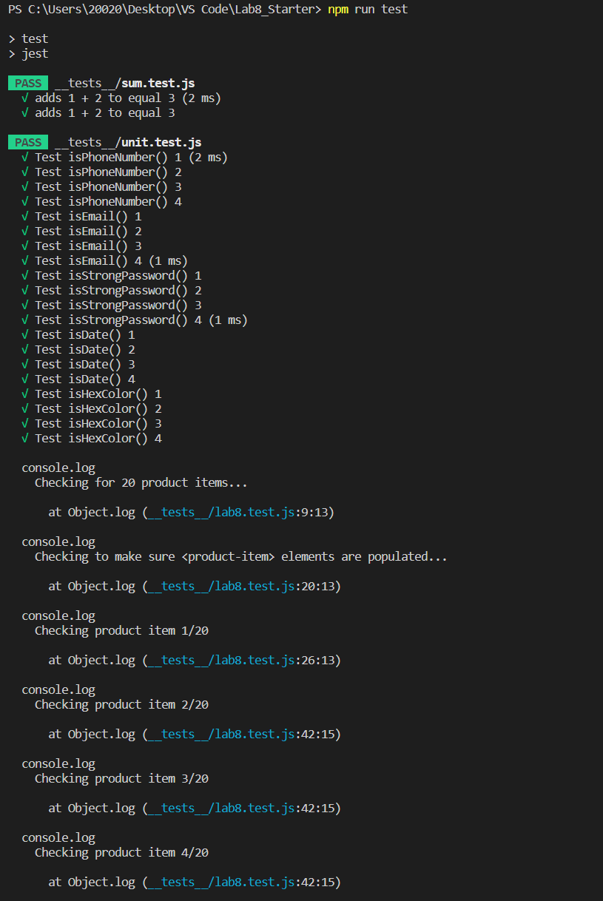
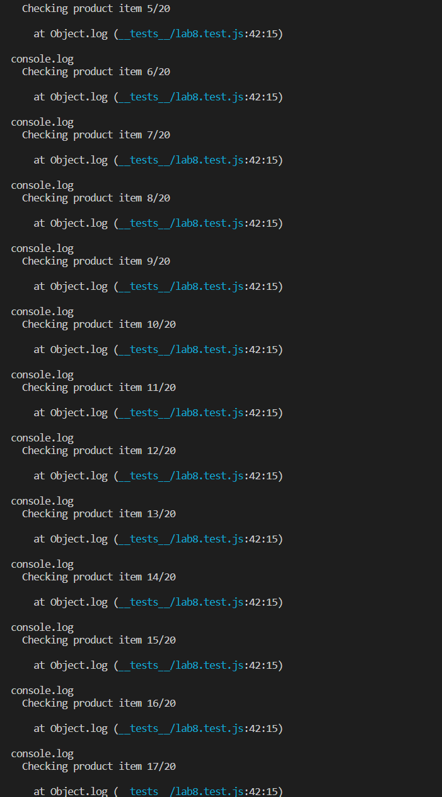
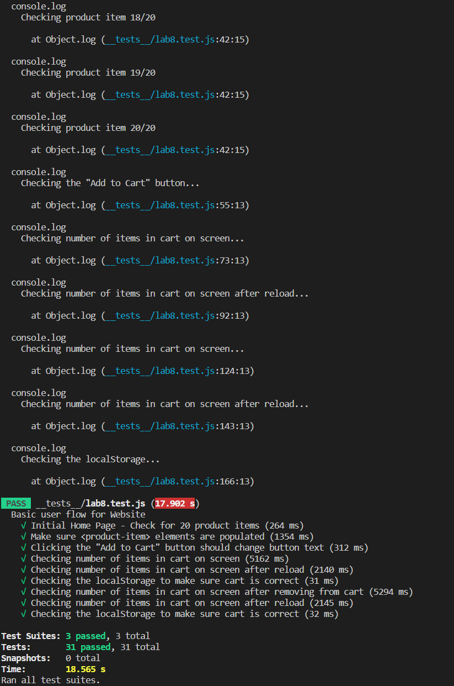

# Lab 8 - Starter

# Work Alone

1) Where would you fit your automated tests in your Recipe project development pipeline? Select one of the following and explain why.
    > Within a Github action that runs whenever code is pushed. Why? Since we are practicing Agile methodology, we are updating our software with small batches of updates. Therefore, it is necessary to test these small updates in time. Github action can automatically run when we push to the main branch, so it guarantes necessary testing and is perfect for us to use. 
2) Would you use an end to end test to check if a function is returning the correct output? (yes/no)
    > No, because we are testing user actions, so we do not know if the function returns the correct output.
3) Would you use a unit test to test the “message” feature of a messaging application? Why or why not? For this question, assume the “message” feature allows a user to write and send a message to another user.
    > No because a unit test is to test individual functions of our application. The “message” feature requires functions to interact with each other within that application, so it is not the job of a unit test. 
4) Would you use a unit test to test the “max message length” feature of a messaging application? Why or why not? For this question, assume the “max message length” feature prevents the user from typing more than 80 characters.
    > Yes because a unit test is to test the feature of a single function. "max message length" is a single function (feature) of this app, so we can use a unit test. 

